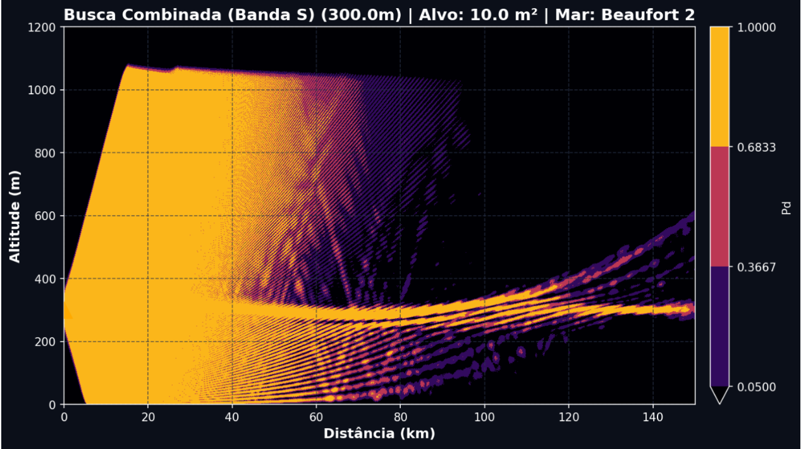

# 📡 AURA - Tactical Radar Prediction System (Demo)



Este repositório contém a versão de demonstração do **AURA**, um motor tático para predição de alcance radar baseado em propagação **SSFT (Split-Step Fourier Transform)**.

O sistema analisa o impacto de anomalias de refração atmosférica (dutos de evaporação e camadas de inversão) na Probabilidade de Detecção ($P_d$) de sensores em ambiente marítimo.

## 🛡️ Arquitetura e Segurança
Para proteger a propriedade intelectual dos algoritmos matemáticos e garantir a performance, o motor principal foi:
1. **Compilado em C via Cython**, transformando o código Python em binários protegidos.
2. **Conteinerizado em Docker**, isolando todas as dependências complexas (FFT, modelos termodinâmicos).
3. **Distribuído como Microsserviço**, separando a lógica de cálculo (FastAPI) da interface do operador (Streamlit).

## 🚀 Como Executar (Zero Setup)
Graças à arquitetura de contêineres blindados, você pode rodar o sistema completo sem instalar nenhuma biblioteca local.

### Pré-requisitos
* [Docker Desktop](https://www.docker.com/products/docker-desktop) instalado.

### Execução
1. Baixe o arquivo `docker-compose.yml` deste repositório.
2. No terminal, dentro da pasta do arquivo, execute:
   ```bash
   docker-compose up
3. Acesse no seu navegador:

Interface do Operador: http://localhost:8501

Documentação da API: http://localhost:8000/docs

📊 Capacidades de Demonstração
Nesta versão, você pode simular o impacto de:

Sensores: Diferentes bandas (S, C, L, X) em alturas variadas.

Ambiente: Estado do mar (Escala Beaufort) e perfis de radiossonda.

Alvos: Seção Reta Radar (RCS) variável.
